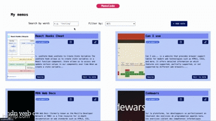
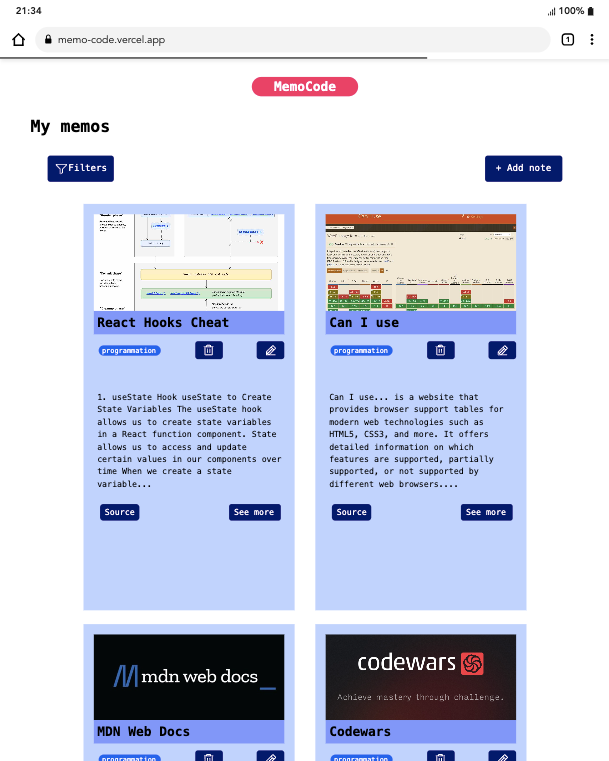
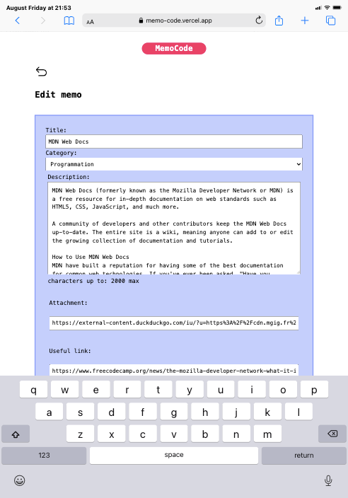
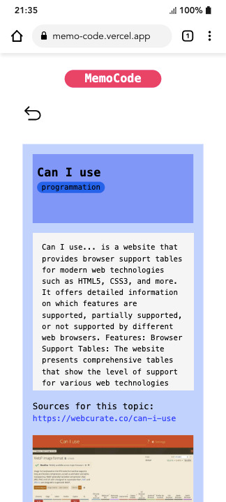

# MemoCode


## Live Demo

Check out the live version of MemoCode here:
[https://memo-code.vercel.app/](https://memo-code.vercel.app/)

## Table of Contents

- [MemoCode](#memocode)
  - [Live Demo](#live-demo)
  - [Table of Contents](#table-of-contents)
  - [Introduction](#introduction)
    - [Purpose](#purpose)
    - [Technologies stack](#technologies-stack)
  - [Installation](#installation)
    - [Clone the repository](#clone-the-repository)
    - [Install dependencies](#install-dependencies)
    - [Get your MongoDB URI](#get-your-mongodb-uri)
    - [Setup environment variables](#setup-environment-variables)
  - [Usage](#usage)
    - [Client](#client)
    - [Server](#server)
  - [Features](#features)
  - [Roadmap](#roadmap)
  - [License](#license)

## Introduction

MemoCode is a full-stack web application built with **React**, **Express**, **Node** and **MongoDB**. It allows you to create notes, read, edit and delete them as long as you like. It uses a clean and responsive interface.

<div style="text-align: center;" width="100%" height="100%">

<div style="display: flex; gap: 5px; flex-wrap: wrap; justify-content: space-evenly;">

<div style="width: 100%; display: flex; justify-content: space-evenly; align-items: center; gap: 50px;">






</div>

</div>
</div>

### Purpose

This project goal is to provide a unique centralized space and get an **easy access** at all the keys resources and concepts from the web development industry that I learn. As I read blogs, articles and documentations, it gets really challenging to keep track of all the information. MemoCode is my tool solution to solve this problem.

### Technologies stack

This project implements full **CRUD** functionality - **_CREATE_**, **_READ_**, **_UPDATE_** and **_DELETE_** via RESTful API endpoints.

The following stacks are those that have been used in the project:

```
| Front-End  | Back-End | Database       |
| ---------- | -------- | -------------- |
| React.js   | Express  | MongoDB Atlas  |
| JavaScript | Node.js  | MongoDB Driver |
| SCSS/SASS  | Nodemon  | -------------- |
```

## Installation

### Clone the repository

To get the project on your local device, run this command in your terminal:

```
git clone https://github.com/vickyfrosties/MemoCode.git
```

Then open the project in your editor and run those commands in **separate** terminals:

- Navigate to the client folder

```
cd MemoCode/frontend/
```

- Navigate to the server folder

```
cd MemoCode/backend/
```

### Install dependencies

Now, to install all the dependencies, you have to install the package manager (`node_modules`) on each folder. Also, make sure you are in the correct directory.

With `npm` as the package manager, run these commands:

- Client (_MemoCode/frontend/_)

```
MemoCode/frontend/
npm install
```

- Server (_MemoCode/backend/_)

```
MemoCode/backend/
npm install
```

With `yarn` as the package manager, run these commands:

- Client (_MemoCode/frontend/_)

```
cd MemoCode/frontend/
yarn install
```

- Server (_MemoCode/backend/_)

```
cd MemoCode/backend/
yarn install
```

### Get your MongoDB URI

To run the project locally, you need a **MongoDB Atlas Cluster**. Follow the steps:

1. Go to [MongoDB Atlas](https://www.mongodb.com/cloud/atlas) and create a free account.
2. Create a new **Project** and then a **Cluster** (choose the free "Shared" plan).
3. Once the cluster is ready:
   - Click **Database Access** → add a new user with a username & password.
   - Click **Network Access** → allow access from your IP address (or `0.0.0.0/0` for testing but temporary only, **DO NOT** forget to **delete** it after use).
4. Go back to **Clusters** and click on **Connect**. Then choose **Connect your application**.
5. Copy the connection string. It looks like this:

   ```
   mongodb+srv://<username>:<password>@cluster0.xxxxx.mongodb.net/<databaseName>?retryWrites=true&w=majority
   ```

6. Replace `<username>`, `<password>`, and `<databaseName>` with your values.
7. Paste this string in your `.env` file under the variable `MONGO_URI`.

### Setup environment variables

There are two ways to configure the project environment variables:

- **Option 1: Demo collection (as in the live demo)**:
  Copy/paste the `.env.example` file and rename it to `.env`. Then update the variables as following:

```
MONGO_URI=your_mongo_uri
MONGO_COLLECTION=demoNotes
SERVER_PORT=8000
CLIENT_PORT=5173
```

- **Option 2: If you want to have your own Mongo DB collection**: Copy/paste the `.env.example` file and rename it to `.env`. Then update the variables as following:

```
MONGO_URI=your_mongo_uri
MONGO_COLLECTION=your_collection_name
SERVER_PORT=8000
CLIENT_PORT=5173
```

**Note: `SERVER_PORT` and `CLIENT_PORT` are only used for local purpose.**

## Usage

❗️**Important**: **Both sides** of the project - **Client AND Server** - have to run at the same time. Split your terminal in **two separate terminals**: one for client - one for server.

### [Client](frontend/README.md)

To run the client side, execute the following command on the **client** terminal:

```
npm run dev
```

### [Server](backend/README.md)

To run the server and the database connection, execute the following command on the **server** terminal:

```
npm run dev
```

You should see a logging message such as :

```
"MongoDB is connected!"
```

This is the sign that the server and database are running and so the project is ready to be used. Next step, go on [http://localhost:5173](http://localhost:5173/) in your browser it should open the web application.

## Features

MemoCode features that are currently available:

- Create, edit, delete and read your notes
- MongoDB Atlas integration
- RESTful API with Express
- Responsive and clean UI
- SCSS/SASS for styling

## Roadmap

You will find all the features that I will implement in the future.

- [ ] **Add custom filters categories**

Possibility to create as many personal filters as you want.

- [ ] **Allow multiple links sources**

Add more than one link to make the information more reliable and complete.

- [ ] **Implement authentification system**

Implement both register & login system for security purposes and user experience. Each user will have access to their own memos without having to create a personal cluster.

- [ ] **Create dynamic filter words indication**

Word filter overlined to indicate where does the word match in the note description or title.

## License

This project is for demonstration purposes only.

All rights reserved © 2025 Sounia Mhalla.
